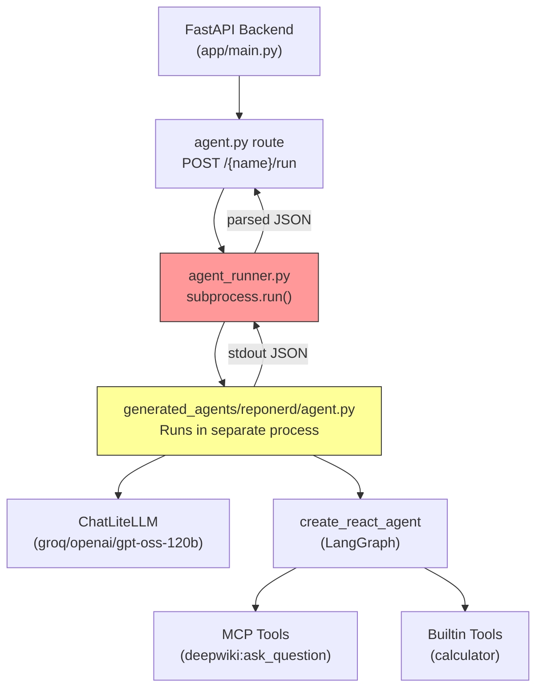
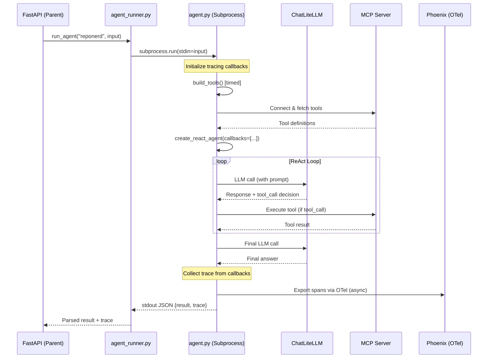
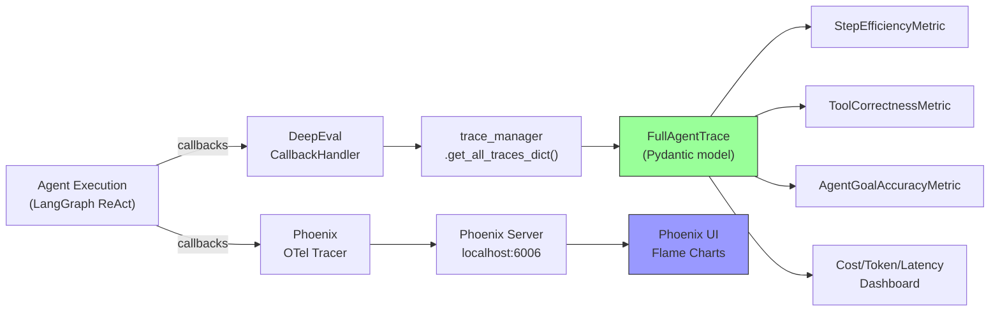

# Agent Traceability & Observability — Implementation Plan

## Problem Statement

Our agents (e.g., `reponerd`) built with **LangGraph + LangChain + LiteLLM + MCP** currently capture only a minimal trace: the final answer and a flat list of tool-call names/args (see [eval_adaptor.py](file:///c:/Users/120606/Desktop/Arun/Agent_workspace/app/services/eval_adaptor.py)). We have **zero visibility** into:

- LLM prompts & completions (what the model actually "thought")
- Token counts (input/output/total per LLM call)
- Cost per LLM call and overall cost
- Latency breakdown (LLM time vs tool time vs MCP time vs total)
- Tool inputs and outputs (only inputs are captured today, outputs are lost)
- MCP connection, MCP call inputs/outputs, MCP errors
- Planning / reasoning steps, retries, error recovery
- Sub-agent handoffs (if added later)

The goal is to get **complete end-to-end traceability** of every agent execution so that:
1. We can feed rich traces into **DeepEval's metrics** (e.g., `AgentGoalAccuracyMetric`, `ToolCorrectnessMetric`, `StepEfficiencyMetric`)
2. We can monitor **cost, tokens, and latency** per step and overall
3. The tracing solution works as a **separate, non-invasive layer** (no modification to existing agent files)

---

## Current Architecture Analysis



> [!IMPORTANT]
> **Critical architectural constraint**: Agents run as **separate subprocesses** via [agent_runner.py](file:///c:/Users/120606/Desktop/Arun/Agent_workspace/app/services/agent_runner.py) (`subprocess.run()`). Tracing must be initialized **inside the agent process**, not in the parent FastAPI process. This rules out any approach that only instruments the parent process.

### Key Files

| File | Role | Trace-Relevant Details |
|------|------|----------------------|
| [agent_template.py.jinja](file:///c:/Users/120606/Desktop/Arun/Agent_workspace/app/templates/agent_template.py.jinja) | Generates every agent's `agent.py` | Single point of change — modify template = all agents get tracing |
| [agent.py (reponerd)](file:///c:/Users/120606/Desktop/Arun/Agent_workspace/generated_agents/reponerd/agent.py) | Live agent instance | Uses `create_react_agent`, `ChatLiteLLM`, `MultiServerMCPClient` |
| [eval_adaptor.py](file:///c:/Users/120606/Desktop/Arun/Agent_workspace/app/services/eval_adaptor.py) | Bridges agent output → eval metrics | Currently extracts `answer` + shallow `tool_calls` |
| [metric_registry.py](file:///c:/Users/120606/Desktop/Arun/Agent_workspace/app/services/metric_registry.py) | DeepEval metrics (GEval, TaskCompletion) | Needs richer trace data for advanced metrics |
| [scratch_step_efficiency_test.py](file:///c:/Users/120606/Desktop/Arun/Agent_workspace/scratch_step_efficiency_test.py) | POC using DeepEval's `CallbackHandler` | **Already proves** DeepEval tracing works with LangGraph |

---

## Framework Comparison & Recommendation

### Frameworks Evaluated

| Criteria | DeepEval Tracing | Arize Phoenix | Langfuse | LangSmith |
|----------|:----------------:|:-------------:|:--------:|:---------:|
| **LangGraph native support** | ✅ via `CallbackHandler` | ✅ via OTel auto-instrument | ✅ via `CallbackHandler` | ✅ Best-in-class |
| **LiteLLM support** | ✅ LangChain callbacks | ✅ via OTel | ✅ via callbacks | ✅ via callbacks |
| **MCP call tracing** | ⚠️ Captures as tool calls | ⚠️ Captures as tool spans | ⚠️ Captures as tool spans | ⚠️ Captures as tool spans |
| **Token counting** | ✅ via spans | ✅ Automatic | ✅ Automatic | ✅ Automatic |
| **Cost tracking** | ⚠️ Manual | ✅ Built-in model pricing | ✅ Built-in model pricing | ✅ Built-in model pricing |
| **Latency breakdown** | ✅ Per span | ✅ Per span | ✅ Per span | ✅ Per span |
| **DeepEval integration** | ✅ Native (same library) | ❌ Requires export bridge | ❌ Requires export bridge | ❌ Requires export bridge |
| **Self-hosted / Free** | ✅ Fully local | ✅ OSS (local server) | ✅ OSS (Docker) | ⚠️ Free tier: 5K traces/mo |
| **No extra infra** | ✅ In-process | ❌ Needs Phoenix server | ❌ Needs Docker stack | ❌ Needs cloud/self-host |
| **Setup complexity** | 🟢 Low (1 callback) | 🟡 Medium (OTel + server) | 🟡 Medium (Docker + keys) | 🟢 Low (env vars) |

### Evaluation of Existing POC

Your [scratch_step_efficiency_test.py](file:///c:/Users/120606/Desktop/Arun/Agent_workspace/scratch_step_efficiency_test.py) already demonstrates:
```python
handler = CallbackHandler(metrics=[metric])
result = await agent.ainvoke(
    {"messages": [...]},
    config={"callbacks": [handler]},
)
traces = trace_manager.get_all_traces_dict()
```
This proves **DeepEval's `CallbackHandler` already works with your LangGraph agents**.

---

### Recommended Approach: Dual-Layer Strategy

> [!TIP]
> **Primary: DeepEval `CallbackHandler`** (for eval-integrated tracing) + **Secondary: Arize Phoenix** (for rich observability dashboard, cost/token tracking)

#### Why this combination?

1. **DeepEval `CallbackHandler`** — Already proven in your codebase. Captures the full agent trajectory (LLM calls, tool calls, planning steps) and feeds directly into DeepEval metrics like `AgentGoalAccuracyMetric`, `ToolCorrectnessMetric`, `StepEfficiencyMetric`. Zero extra infrastructure.

2. **Arize Phoenix** — Adds a visual dashboard with flame charts, latency waterfall, automatic cost/token tracking from built-in model pricing tables. Runs locally (`python -m phoenix.server.main serve` → `localhost:6006`). Uses OpenTelemetry, so it's vendor-neutral and future-proof.

3. **Both use LangChain's callback system** — they can coexist as two callbacks in the same `config={"callbacks": [deepeval_handler, phoenix_tracer]}` list with zero conflict.

---

## Feasibility Assessment

### What we CAN trace (high confidence)

| Trace Element | How It's Captured | Source |
|---------------|-------------------|--------|
| **LLM prompts & completions** | `CallbackHandler` intercepts `on_llm_start` / `on_llm_end` | LangChain callback protocol |
| **Tool call name + inputs** | `on_tool_start` callback | LangChain callback protocol |
| **Tool outputs** | `on_tool_end` callback | LangChain callback protocol |
| **MCP tool calls** (inputs/outputs) | MCP tools are registered as LangChain tools via `langchain-mcp-adapters` — traced identically to builtin tools | [agent.py L34-38](file:///c:/Users/120606/Desktop/Arun/Agent_workspace/generated_agents/reponerd/agent.py#L34-L38) |
| **Token counts** (input/output/total) | LiteLLM returns token metadata in response; callbacks capture it | `ChatLiteLLM` → LangChain `LLMResult` |
| **Latency per step** | Timestamp diff between `on_*_start` and `on_*_end` | Callback timing |
| **Overall runtime** | Outer `time.time()` wrapper | Custom instrumentation |
| **Planning / reasoning chain** | LangGraph's ReAct loop emits agent messages with reasoning | `create_react_agent` message history |
| **Errors & exceptions** | `on_llm_error`, `on_tool_error` callbacks | LangChain callback protocol |
| **Retries** | Each retry is a separate LLM call → separate span | Automatic |

### What requires additional work

| Trace Element | Gap | Solution |
|---------------|-----|----------|
| **MCP connection latency** | MCP connection happens in `build_tools()` before agent runs | Wrap `build_tools()` with timing instrumentation |
| **Cost per LLM call** | LiteLLM doesn't always emit cost; model pricing varies | Use Phoenix's pricing tables OR LiteLLM's `completion_cost()` utility |
| **Sub-agent handoffs** | Not applicable today (single-agent architecture) | Future: Use LangGraph's multi-agent support with `@observe` decorators |
| **Custom metadata** (agent name, model, prompt) | Not auto-captured | Pass as `metadata` dict in callback config |

### Subprocess Constraint — Solution

Since agents run as subprocesses, tracing must be initialized inside [agent_template.py.jinja](file:///c:/Users/120606/Desktop/Arun/Agent_workspace/app/templates/agent_template.py.jinja). The trace data must be **serialized to stdout** alongside the existing JSON result, then parsed by [agent_runner.py](file:///c:/Users/120606/Desktop/Arun/Agent_workspace/app/services/agent_runner.py).



---

## Proposed Implementation — New Files Only

> [!IMPORTANT]
> As instructed, **no existing files will be modified**. The tracing system will be built as a **separate, pluggable module** that can be imported and used by future agent templates.

### Component 1: Tracing Module

#### [NEW] `app/tracing/__init__.py`
Empty init file for the tracing package.

#### [NEW] `app/tracing/tracer.py`
Core tracing orchestrator that:
- Initializes DeepEval `CallbackHandler` and optionally Phoenix OTel tracer
- Provides a `get_callbacks()` function returning the list of callback handlers
- Provides a `collect_trace()` function that gathers the full trace tree from `trace_manager`
- Wraps timing for `build_tools()` (MCP connection phase)

```python
# Pseudocode structure
class AgentTracer:
    def __init__(self, agent_name, model_string, metrics=None):
        self.deepeval_handler = CallbackHandler(metrics=metrics or [])
        self.phoenix_tracer = None  # optional
        self.timings = {}
    
    def get_callbacks(self) -> list:
        """Returns callback handlers to pass to agent.ainvoke()"""
        
    def start_phase(self, phase_name: str):
        """Mark start of a named phase (e.g. 'mcp_connect', 'agent_run')"""
        
    def end_phase(self, phase_name: str):
        """Mark end of a named phase"""
        
    def collect_trace(self) -> dict:
        """Collect full trace from DeepEval trace_manager + custom timings"""
```

#### [NEW] `app/tracing/trace_schema.py`
Pydantic models for the structured trace output:

```python
class LLMCallTrace(BaseModel):
    call_index: int
    model: str
    prompt: str               # Full prompt sent to LLM
    completion: str           # Full LLM response
    input_tokens: int
    output_tokens: int
    total_tokens: int
    cost_usd: float | None
    latency_ms: float
    timestamp: str

class ToolCallTrace(BaseModel):
    call_index: int
    tool_name: str
    tool_type: str            # "builtin" | "mcp"
    mcp_server: str | None    # e.g. "deepwiki"
    inputs: dict
    output: str
    latency_ms: float
    success: bool
    error: str | None

class MCPConnectionTrace(BaseModel):
    server_id: str
    url: str
    transport: str
    connect_latency_ms: float
    tools_discovered: list[str]
    success: bool
    error: str | None

class AgentStepTrace(BaseModel):
    step_index: int
    step_type: str            # "planning" | "llm_call" | "tool_call" | "final_answer"
    content: dict             # Polymorphic content based on step_type
    timestamp: str

class FullAgentTrace(BaseModel):
    trace_id: str
    agent_name: str
    model: str
    input_text: str
    final_answer: str
    
    # Detailed traces
    steps: list[AgentStepTrace]
    llm_calls: list[LLMCallTrace]
    tool_calls: list[ToolCallTrace]
    mcp_connections: list[MCPConnectionTrace]
    
    # Aggregated metrics
    total_llm_calls: int
    total_tool_calls: int
    total_input_tokens: int
    total_output_tokens: int
    total_tokens: int
    total_cost_usd: float | None
    total_latency_ms: float
    mcp_connect_latency_ms: float
    agent_run_latency_ms: float
    
    # Error summary
    errors: list[dict]
    retry_count: int
```

#### [NEW] `app/tracing/cost_calculator.py`
Utility to compute per-call and total costs:
- Uses LiteLLM's `litellm.completion_cost()` for supported models
- Falls back to a configurable pricing table for custom/groq models
- Tracks cumulative cost across all LLM calls in a run

#### [NEW] `app/tracing/phoenix_exporter.py`
Optional module to export traces to Arize Phoenix:
- Configures OTel exporter pointing to `localhost:6006`
- Uses `openinference-instrumentation-langchain` for auto-instrumentation
- Can be enabled/disabled via environment variable `PHOENIX_ENABLED=true`

---

### Component 2: Traced Agent Template

#### [NEW] `app/templates/agent_template_traced.py.jinja`
A new Jinja template that extends the current agent template with tracing:
- Imports and initializes `AgentTracer`
- Times `build_tools()` for MCP connection latency
- Passes callbacks to `agent.ainvoke(config={"callbacks": tracer.get_callbacks()})`
- Collects full trace and includes it in the stdout JSON output
- Structure of output changes from `{"status", "result": {"answer", "tool_calls"}}` to `{"status", "result": {"answer", "tool_calls"}, "trace": {FullAgentTrace}}`

---

### Component 3: Integration with Eval Pipeline

#### [NEW] `app/services/traced_eval_adaptor.py`
Enhanced version of [eval_adaptor.py](file:///c:/Users/120606/Desktop/Arun/Agent_workspace/app/services/eval_adaptor.py) that:
- Extracts the rich trace from agent output
- Maps trace data to DeepEval's expected format for advanced metrics
- Provides `actual_steps` for `StepEfficiencyMetric`
- Provides `tools` and `tool_outputs` for `ToolCorrectnessMetric`
- Provides full trajectory for `AgentGoalAccuracyMetric`

#### [NEW] `app/services/traced_metric_registry.py`
Extended metric registry adding trace-aware metrics:
- `StepEfficiencyMetric` — evaluates if agent took optimal path
- `ToolCorrectnessMetric` — evaluates if correct tools were called with correct args
- `AgentGoalAccuracyMetric` — evaluates if agent achieved the stated goal
- All powered by the rich trace data from `FullAgentTrace`

---

### Component 4: API Endpoint

#### [NEW] `app/api/routes/trace.py`
New FastAPI route for traced agent runs:
- `POST /agents/{name}/run-traced` — Runs agent with full tracing, returns `FullAgentTrace`
- `POST /agents/{name}/evaluate-traced` — Runs eval with trace-aware metrics
- Separates traced runs from normal runs so existing behavior is unchanged

---

## New Dependencies

```toml
# Add to pyproject.toml
[project.dependencies]
# ... existing deps ...
arize-phoenix = ">=5.0.0"           # Phoenix observability (optional)
arize-phoenix-otel = ">=0.6.0"     # OTel integration for Phoenix
openinference-instrumentation-langchain = ">=0.1.0"  # Auto-instrument LangChain
```

> [!NOTE]
> `deepeval` is already installed (see [pyproject.toml](file:///c:/Users/120606/Desktop/Arun/Agent_workspace/pyproject.toml) via `agent-evaluator` dependency). DeepEval's `CallbackHandler` and `trace_manager` are already available — confirmed by the working [scratch_step_efficiency_test.py](file:///c:/Users/120606/Desktop/Arun/Agent_workspace/scratch_step_efficiency_test.py).

---

## Data Flow: Trace → DeepEval Metrics



---

## Verification Plan

### Automated Tests
```bash
# 1. Unit test the tracing module
python -m pytest tests/test_tracing.py -v

# 2. Run a traced agent invocation against reponerd
python -c "from app.tracing.tracer import AgentTracer; print('Import OK')"

# 3. End-to-end: Run traced agent and verify trace output structure
curl -X POST http://localhost:8000/agents/reponerd/run-traced \
  -H "Content-Type: application/json" \
  -d '{"input_text": "What is the star count for octocat/Spoon-Knife?"}' \
  | python -m json.tool
```

### Manual Verification
1. Run `reponerd` agent with tracing enabled
2. Verify trace JSON contains: LLM calls with token counts, MCP tool call with inputs/outputs, latency breakdown
3. If Phoenix is enabled: verify spans appear in `localhost:6006`
4. Feed trace into `StepEfficiencyMetric` and verify evaluation runs successfully

---

## Open Questions

> [!IMPORTANT]
> **Q1: Subprocess vs In-process execution**
> Currently agents run as subprocesses. The trace data must be serialized to JSON and passed via stdout. This works but adds serialization overhead (~1-5ms). 
> **Alternative**: Should we consider switching to in-process execution (importing and calling `run()` directly) for traced runs? This would give direct access to callback data without serialization, but would change the isolation model.

> [!IMPORTANT]
> **Q2: Phoenix dashboard — do you want it?**
> Arize Phoenix adds a visual dashboard (`localhost:6006`) with flame charts, token/cost breakdowns, and latency waterfalls. However, it requires running a separate server process. 
> - **Option A**: Include Phoenix from day one (richer observability, ~10 min setup)
> - **Option B**: Start with DeepEval-only tracing (simpler, zero extra infra), add Phoenix later

> [!WARNING]
> **Q3: Traced template strategy**
> Should we create a **separate** `agent_template_traced.py.jinja` (keeping the original untouched) or should we make the original template tracing-aware with an on/off flag? A separate template means two templates to maintain; a flag-based approach means modifying the existing template.

> [!NOTE]
> **Q4: Cost tracking for Groq-hosted models**
> The `reponerd` agent uses `groq/openai/gpt-oss-120b`. LiteLLM's `completion_cost()` may not have pricing for this custom model. We may need to either:
> - Configure a custom pricing entry in LiteLLM
> - Skip cost tracking for unsupported models (track tokens only)
> - Maintain our own pricing table in `cost_calculator.py`

---

## Summary

| Aspect | Recommendation |
|--------|----------------|
| **Primary tracing framework** | **DeepEval `CallbackHandler`** — already proven in your codebase, zero infra, direct eval integration |
| **Secondary observability** | **Arize Phoenix** (optional) — OTel-based dashboard for visual debugging |
| **Why not LangSmith?** | Proprietary, SaaS-dependent, costs scale with trace volume, vendor lock-in |
| **Why not Langfuse?** | Requires Docker infra (Postgres + Next.js), more complex than needed for eval-focused tracing |
| **Existing files modified** | **None** — all new modules in `app/tracing/`, new templates, new routes |
| **Feasibility** | ✅ **High** — POC already works ([scratch_step_efficiency_test.py](file:///c:/Users/120606/Desktop/Arun/Agent_workspace/scratch_step_efficiency_test.py)), LangChain callback protocol captures all needed data |
